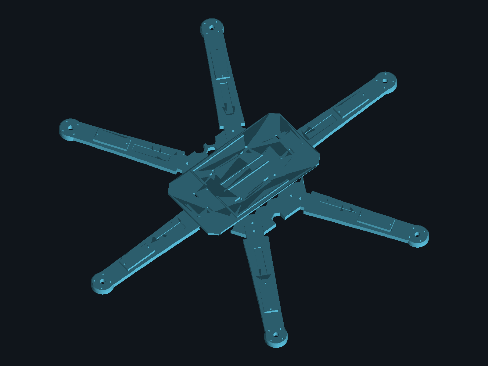
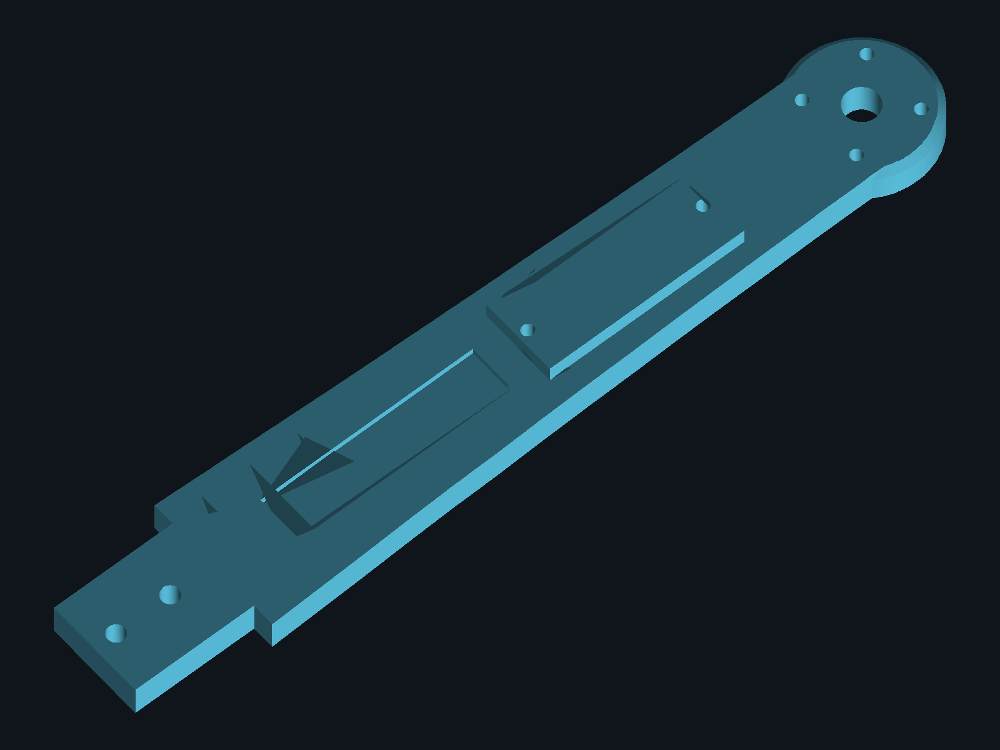
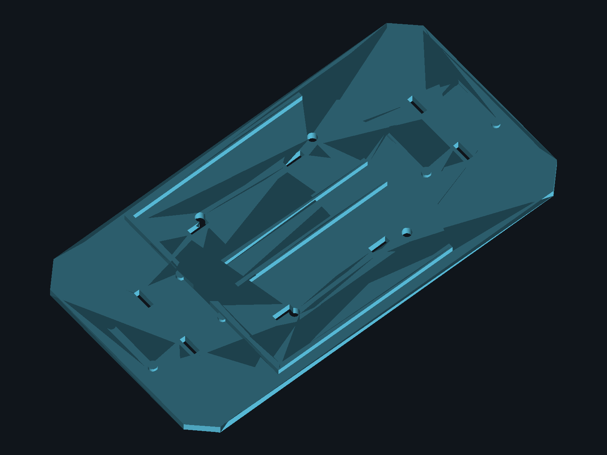

<div align="center">

# SkyVolt

**Drone medidor e fiscalizador de ambientes de alta e baixa energia**



</div>

Hexacóptero de estrutura impressa em 3D cuja função principal é medir tensão e corrente elétrica em pontos de um ambiente controlado, classificar automaticamente o tipo de circuito (AC/DC, faixa de tensão) e reportar os dados a um aplicativo desktop de controle e monitoramento em tempo real via LoRa.

Projeto da disciplina 34943 — Desenvolvimento de Aplicações Computacionais (tema-base: Monitor de Consumo e Qualidade de Energia / Smart Grid), usando o SkyVolt como o protótipo físico opcional permitido pelo enunciado. Documento completo de requisitos, arquitetura e BOM em [`docs/SkyVolt_Documento.pdf`](docs/SkyVolt_Documento.pdf); Roadmap do semestre (14/08 a 02/12/2026) em [`ideias/roadmap.md`](ideias/roadmap.md); devolutivas das entregas em [`avaliacoes/`](avaliacoes/).

## Equipe

<!-- preencher com nome + usuário GitHub de cada integrante antes da entrega A1/1 — é critério de nota (governança/git) -->
- Matheus Dapper ([@aCoruja](https://github.com/aCoruja))
- _Vitória Aparecida Vendausen([@Viihvendausen](https://github.com/Viihvendausen)_

- _Sophia Gama de Moura ([@Sophthe141](https://github.com/Sophthe141))_

## Estrutura do repositório

```
README.md       este arquivo — visão geral, equipe e estado do projeto
docs/           documentos técnicos: requisitos, arquitetura e BOM (fonte .tex + PDF gerado),
                requisitos funcionais do app desktop
ideias/         planejamento e acompanhamento de ideias — o que o time PLANEJA fazer, semana a semana
avaliacoes/     devolutivas oficiais do professor por entrega — nota, feedback, pontos a corrigir
hardware/       projeto mecânico (CAD paramétrico FreeCAD, STL/STEP para impressão 3D)
  frame/        peças atuais — hub, braço (x6) e bandeja de eletrônica
  legacy/       versão anterior do frame (peça única), mantida como referência
  previews/     renders das peças
firmware/       código dos dois ESP32 (voo/FPV e telemetria/LoRa) — a especificar
app/            aplicativo desktop de controle e monitoramento — a especificar
notebooks/      prototipagem e análise de dados (calibração de sensores, protocolo LoRa, etc.)
```

`ideias/` e `avaliacoes/` são complementares: um documenta o planejamento, o outro o resultado real de cada entrega — mantidos junto ao roadmap para não perder o histórico de evolução da nota ao longo do semestre.

## Estado atual (Rev. 1.3 do documento)

- Requisitos, arquitetura e BOM fechados.
- Frame mecânico redesenhado em 3 peças modulares (hub + braço ×6 + bandeja de eletrônica), validado para impressora de mesa 220×220mm, motor brushless RS1606 3300KV com verificação de empuxo e autonomia.
- Firmware, aplicativo desktop e carcaças dos efetuadores ainda não iniciados — ver Seção 8 (Pendências) do documento.

## Peças (impressão 3D)

Gerado pelo script paramétrico [`skyvolt_frame.py`](hardware/frame/skyvolt_frame.py) (FreeCAD). Arquivos `.stl`/`.step`/`.FCStd` em [`hardware/frame/`](hardware/frame/).

<div align="center">
<table>
<tr>
<td align="center" width="33%">
<br>
<b>Hub</b> — 1× — 129,6×121,2mm
</td>
<td align="center" width="33%">
<br>
<b>Braço</b> — 6× — 154×26mm
</td>
<td align="center" width="33%">
<br>
<b>Bandeja de eletrônica</b> — 1× — 150×80mm
</td>
</tr>
</table>
</div>

Todas as peças cabem numa mesa de impressão de 220×220mm. Hub e braço se unem por encaixe lingueta/rasgo + 2 parafusos M3 por junta; motor RS1606 3300KV (pad 12×12mm/4×M2); braço já sai com base de fixação para servo SG90.
